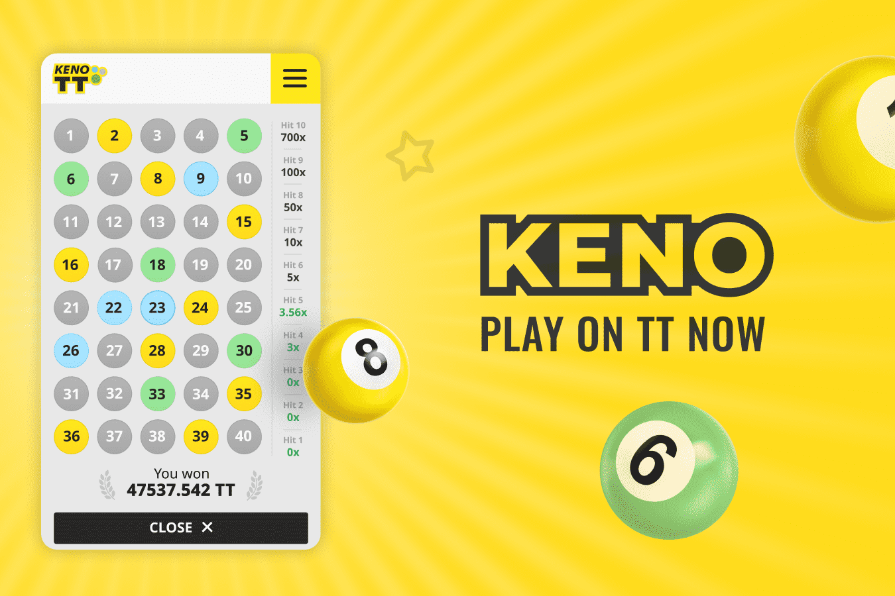

# TT-KENO

TT-Keno 是一款基于区块链 (Dapp) 的游戏，部署在 ThunderCore 协议上
智能合约地址 0x05aA637D1364beF25d1C89735ded26dae2FCA80D

TT-Keno 是一款部署在 ThunderCore 协议上的基于区块链 (Dapp) 的游戏 🔞 - 您必须年满 18 岁并且居住在可以合法投注该服务的国家/地区，（如有疑问，您应该寻求当地 法律咨询）。

TT KENO充分利用了区块链的力量，是一款基于ThunderCore区块链上的NFT+元宇宙的游戏，任何人都可以玩。 任何新玩家都可以赚取游戏代币ThunderCore 在虚拟世界中消费或交易。
NFT 是一种非同质化的代币，NFT 提供了一种解决版权问题的新途径：当一个作品被铸造成 NFT 链时，它被赋予了一个不可篡改的唯一代码。 无论作品被复制和传播多少次，原作者仍然是作品的唯一所有者。 在区块链的帮助下，玩家可以创造稀有的虚拟物品并确保它们的稀缺性。 游戏中的资产绝对真实，TT KENO是赚钱的好工具。

