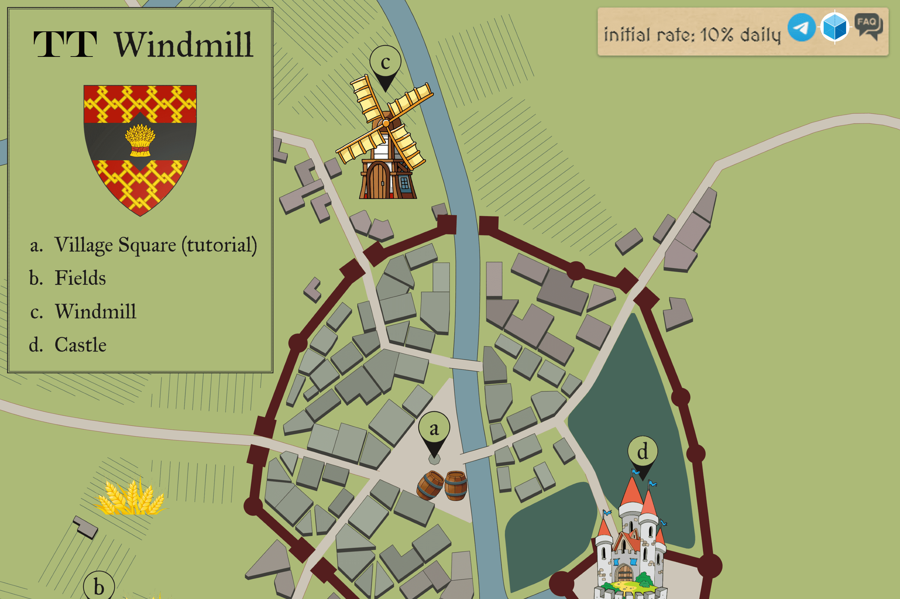

# TT Windmill

TT Windmill 是一款基于 Thundercore 区块链的中世纪游戏。 您可以收获小麦，然后在风车中生产 TT，初始每日回报率为 10%。
游戏的原则是通过在适当的时间再投资小麦（价格变化）来保持您的回报，以便能够收回您的资金并赚取利润（通过在您想要的时候提取）。

多多岛上有五个已知的风车：邮政风车、塔风车、多多谷物风车、托比风车和附近的一个露丝工作室。 五台风车中有四台将多多岛上种植的小麦磨成面粉，用于为附近村庄的居民制作面包，还有一台被改装成电磁发电机，为车间和大门供电。

