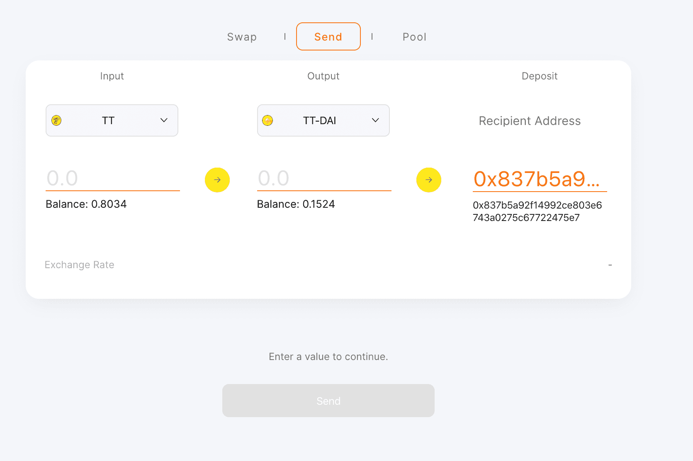

# TTSwap

TTSwap 是基于 Uniswap 和 Vitalik 的想法启发的自动做市（AMM）模型的去中心化交易所（DEX），由第三方开发者构建。 这种 AMM 模型的最大特点是流动性池是完全自动化的，因此用户可以在 ThunderCore 生态系统（如 TT、TT-USDT、NICER……）内以真正去中心化和无需许可的方式交换他们的代币。

TTSwap 使任何人都能够以真正去中心化和无需许可的方式交换代币、提供流动性并参与 ThunderCore 生态系统中的市场。 TTSwap 是 ThunderCore 区块链上的 DEX 去中心化交易所，基于模型：受 Uniswap 启发的自动做市（AMM）。

