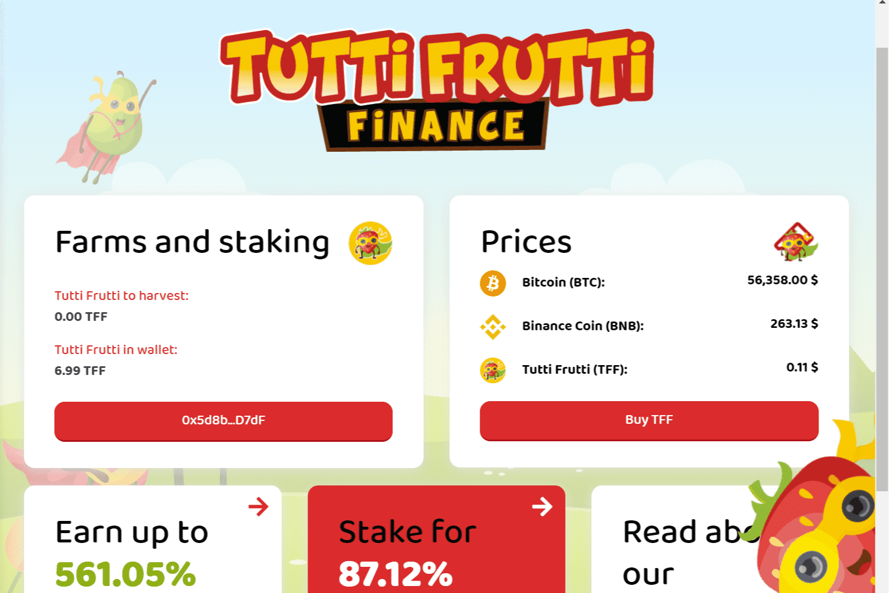

# Tutti Frutti

Tutti Frutti Finance 或 TFF 将是第一个基于币安智能链的低通胀、完全社区分布式的收益农业项目，保证奖励期超过 3 年！

Tutti Frutti Finance 是第一个基于币安智能链的低通胀、社区分布式的收益农业项目，保证长奖励期！

Tutti frutti（来自意大利语 tutti i frutti，“所有水果”；也称为 tutti-frutti）是一种色彩缤纷的糖果，包含各种切碎的水果，通常是蜜饯，或者是模拟许多不同水果和香草的混合风味的人造或天然调味剂，特别是 pollica 变种。 在意大利以外的西方国家以冰淇淋的形式最为引人注目。

