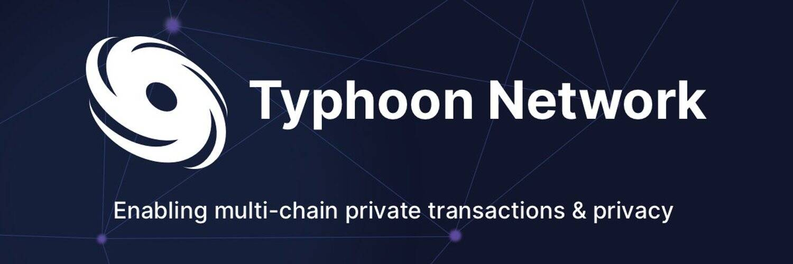

# Typhoon Network

关于台风
Typhoon 允许您在 2 个币安智能链 (BSC) 钱包之间发送安全、私密的交易。 它通过成为中间人来做到这一点：你将一些 BNB 存入合约并收到安全票据作为回报。 谁知道这张纸币，谁就可以从智能合约中赎回存入的余额。
随着时间的推移，一旦有更多的 BNB 积累，你存入的钱就会与其他人的存款混合在一起，这使得不再可能看到谁向谁发送了什么。
为什么这很重要？
区块链在设计上是一个公共分类账。 每笔交易都是公开记录的，任何人都可以看到。 因此，可以推断出 2 个钱包之间的关系，并根据个人随时间的在线行为创建个人资料。 通过让台风作为交易之间的中间人，我们让您更难以追踪资金的目的地和来源，从而为您提供匿名性。

