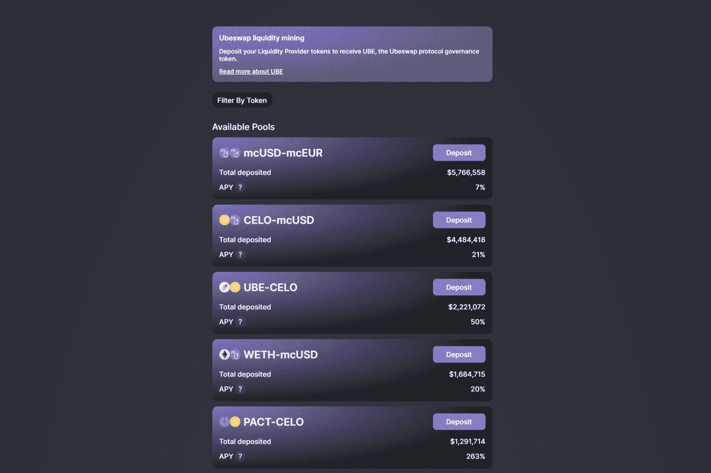

# Ubeswap

Ubeswap 的使命是通过让用户更便宜、更容易地交换、耕种和访问链上新的金融市场来提高 DeFi 的采用率和流动性。

Ubeswap 是 Celo 资产的去中心化交易所和自动化做市商协议。 在 Celo Ubeswap 上为 DeFi 供电是一种移动优先的 DeFi 交换。 启动应用程序

Ubeswap (UBE) 是一种加密货币，在 Celo 平台上运行。 Ubeswap 的当前供应量为 100,000,000，流通量为 0。 Ubeswap 的最后已知价格是 0.03631176 ...

Ubeswap (UBE) 是一种加密货币，在 Celo 平台上运行。 Ubeswap 的当前供应量为 100,000,000，流通量为 0。 Ubeswap 的最新已知价格为 0.03631176 美元，在过去 24 小时内上涨了 4.88 美元。 它目前在 10 个活跃市场上交易，过去 24 小时交易额为 1,947.48 美元。

