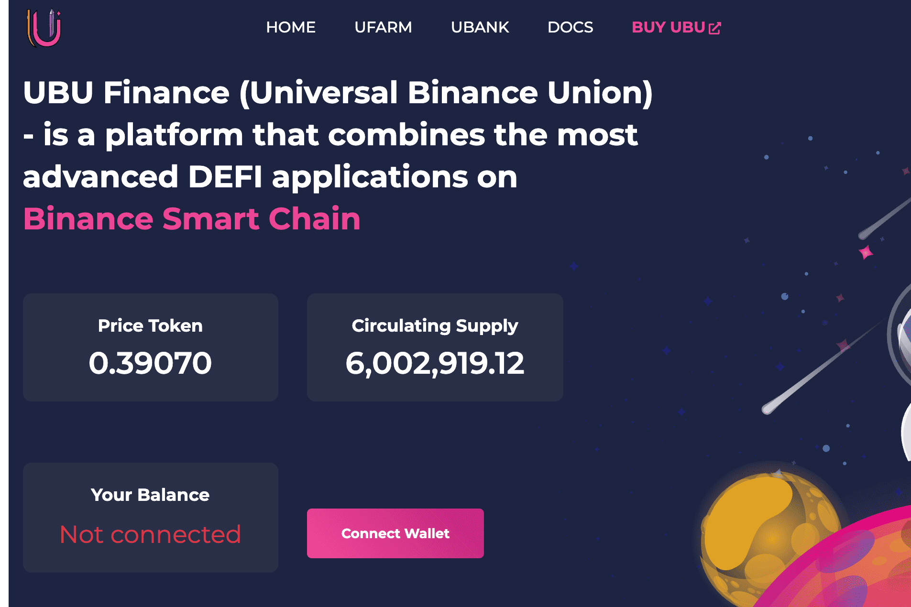

# UBU Finance

UBU Finance (Universal Binance Union) - 是一个将最先进的 DEFI 应用程序与特殊功能相结合的平台，例如通货紧缩、利益共享……它是完全去中心化的。 我们的目标是建立全球金融合作伙伴关系并使 DEFI 平台成为加密货币行业中最强大的平台，我们的目标是进一步发展 DEFI 平台。

UBU Finance (Universal Binance Union) - 是一个结合了 Binance 智能链上最先进的 DEFI 应用的平台 流通供应 1 TVL 价格代币 你的余额 未连接 Connect Wallet UFarm

使用货币转换器，您可以将 UBU 转换为 EUR，并获取 1 UBU Finance 目前以 Euro 计算值多少钱。 . 此外，您可以进行反向计算并计算出 1 Euro兑换 UBU Finance的最新汇率。 . 加密货币转法币. 加密货币转加密货币. 1 UBU Finance (UBU) = Euro "€" (EUR) 保存当前转换.

