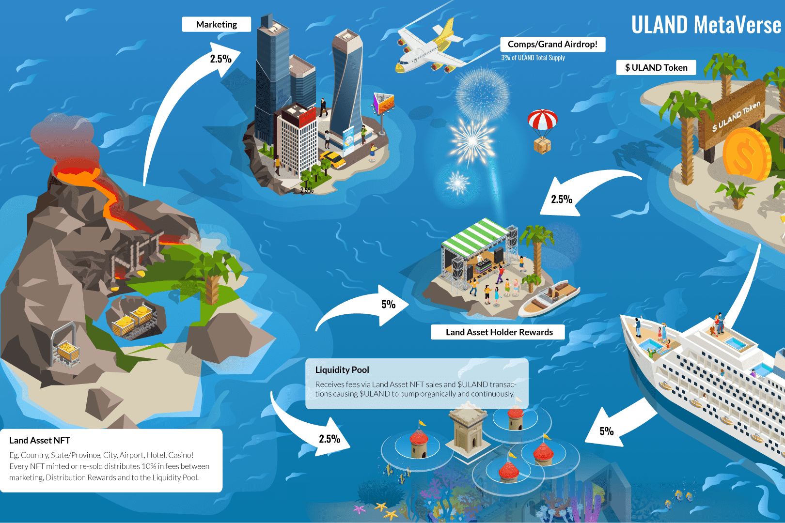

# ULAND

ULAND 是基于币安智能链上的区块链技术构建的虚拟地球。这是同类中第一个基于陆地的 NFT，它反映了地球当前的所有地理位置，并结合了自己的 $ULAND 代币，为 ULAND 的经济提供了动力。
想购买美国、法国还是澳大利亚？或者也许统治纽约市更符合你的喜好？在 ULAND，您决定！每个位置资产都映射到现实世界，因此只有一个澳大利亚或一个加利福尼亚州。
这个怎么运作

  想象一下，你可以成为任何国家的统治者......😁
  您访问世界地图并决定购买美利坚合众国😱
  你现在是美国的统治者（或国王、王后、总统、独裁者，任你选择！），如果你愿意，你甚至可以给你的国家起不同的名字！
  除非您决定出售它（以获得可观的利润🤑），否则这将永远属于您，并以 BEP-721 NFT 的形式获得所有权。但是，你最好坚持一段时间，因为👇
  此后在美国销售的每个州和城市，您都可以通过分发奖励获得奖励💰
  ULAND 也有自己的货币 $ULAND 代币 (BEP-20)。每次有人购买或出售我们的代币时，您都会收到基于您拥有的土地人口的交易百分比。
  为了确保您的投资安全并增加您的土地和代币的价值，所有 NFT 和 $ULAND 代币购买和销售的 % 将转移到锁定流动性中，从而有机地和持续地推动 ULANDs 经济。
  沿着轨道，公民将被邀请通过购买 PASSPORT 搬入您的城市。为最早的土地所有者解锁无与伦比的被动收入机会。
  这是一个社区驱动的项目，为我们的用户打造：ULANDERS！

