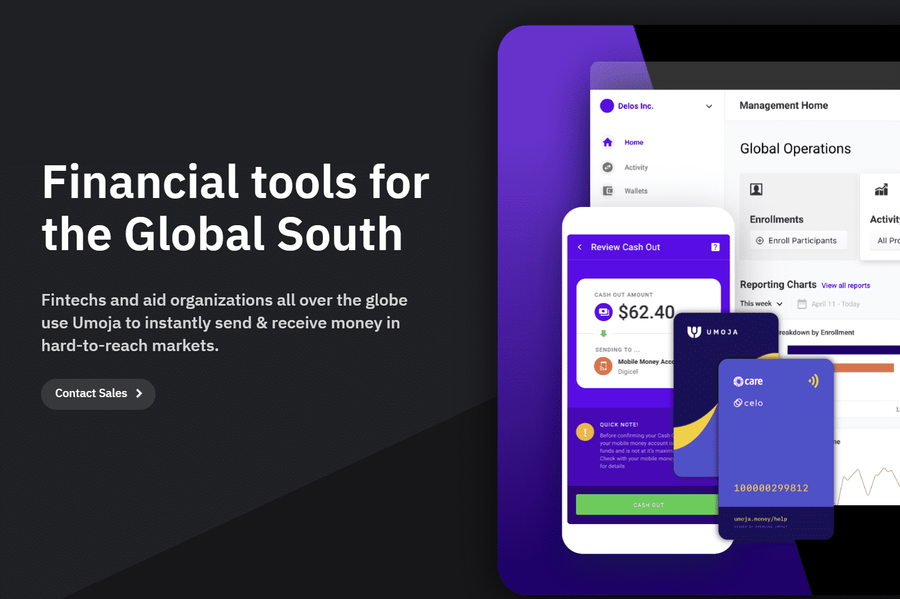

# Umoja

Umoja 支付套件为金融技术和援助组织提供了一个全栈支付工具集，可以在资源最匮乏的环境中运行，包括与 USSD、WhatsApp 和 NFC 卡兼容的数字钱包、移动商家销售点、 用于自动化人道主义援助和小额融资计划的大规模支付仪表板，以及在新兴市场的数字货币、法定货币和移动货币之间提供入口/出口的 DeFi API。

Umoja 是一个单一的全球性解决方案，能够有效和透明地管理联合国的财政、人力和物质资源，并改进方案交付。 作为一个
作为业务转型的催化剂，“团结”项目正在改进财务和行政业务，以及有可能提高本组织效率和总体效力的方案交付。

