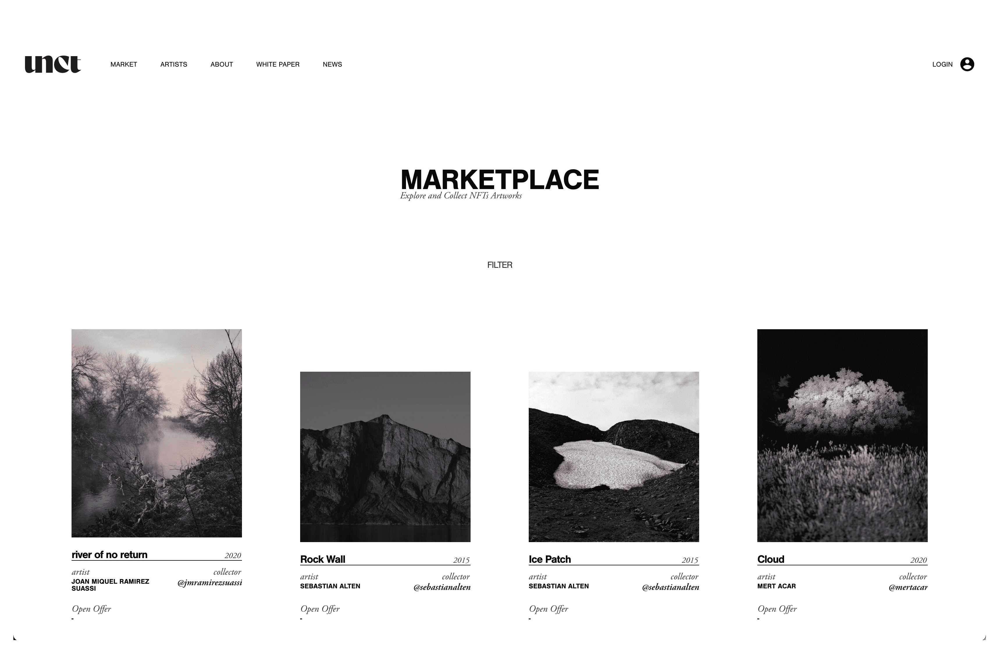

# Uncontaminated

一个专注于摄影和视频艺术的购买平台，通过区块链中出现的技术为艺术品赋予价值，并证明资产的真实性。 在我们的例子中，NFT 就是艺术品本身，它具有一定的价值，可以在 Uncontaminate 平台本身内买卖。

换句话说，地板和未受污染的垃圾坑等原生沉积物相对较少。
剑桥英语语料库から
蚂蚁对死甲虫的清除最大的是未受杀虫剂污染的小甲虫（< 15 毫米长）。
剑桥英语语料库から
用于实验室生物测定的所有昆虫都是在未受污染的牛粪处或附近收集的。

对于搜索行为数据，在未污染滤纸上花费的时间与在幼虫轨道污染滤纸上花费的时间相比是非独立的。

