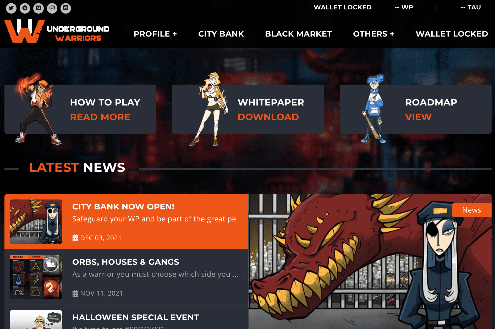

# Underground Warriors

Underground Warriors 是一款在 Lamden 的区块链上开发的赚钱的格斗游戏，您的角色在地下为金钱和名誉而战。 每获得一次胜利，您都会获得 $WP 代币（勇士积分）的奖励。
Underground Warriors 中的每个角色都是独一无二的 NFT。 这种数字资产能够在区块链中升级和发展，从而为您的资产提供与游戏时间相关的价值。
此外，还有其他 NFT 是在游戏中进步所必需的，例如进化水晶。 这些物品可以通过玩和完成任务来获得。 您可以使用、购买或出售它们给其他玩家。

