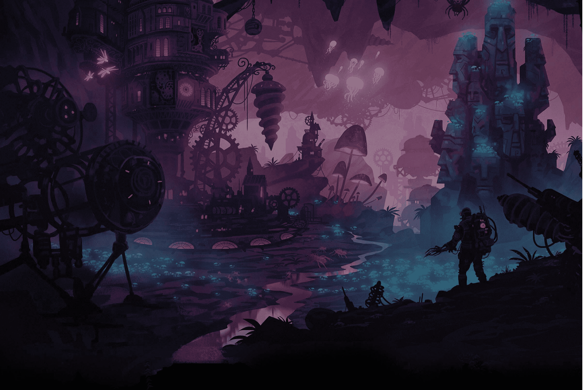

# Undra

Undra 背后的团队（称为 Studio Decent）致力于一个单一的目标：重新构想 Web3 技术以应用于主流游戏。
Undra 是我们游戏的名称。它也是一个虚构的场景，一个 1898 年新发现的岛屿。
此设置旨在成为在游戏环境中试验 Web3 原则的理想场所，而不受 Web3 或 DeFi 空间中使用的现有方法的束缚。我们正在开辟一个新的 Web3 游戏类别，这将与当前工作室尝试整合 Web3 技术完全不同。我们称之为Game3！
Undra 的世界是危险的，每个角落都有风险，而且对你不利。与您的同胞一起工作，是时候在这个荒凉的岛上建立一个新的社会，并努力揭开下面矿井的秘密。
Undra 最初是对早期工业帝国的模拟，后来扩展到以政治和工业为中心的丰富战略游戏。 Undra 看起来不像许多典型的游戏，它的目标是成为另类游戏可以蓬勃发展的环境。
在这里，您会发现类似于模拟、策略和 Roguelike 游戏的游戏形式，围绕着共同重建新社会和经济的虚构目标。

