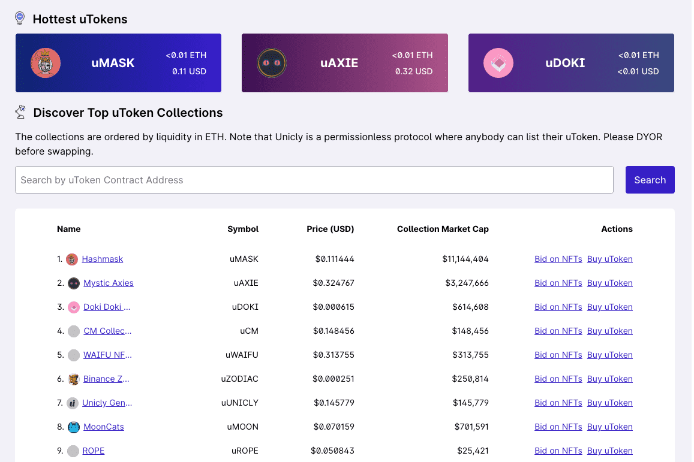

# Unicly

Unicly 是一种无需许可的、由社区管理的协议，用于组合、分割和交易 NFT。该协议由 NFT 收藏家和 DeFi 爱好者构建，通过将 AMM 和收益农业带入 NFT 世界，激励 NFT 流动性并为 NFT 资产提供无缝交易体验。
在 https://docs.unic.ly 上阅读更多信息

在过去的几个月里，Unicly 的开发团队一直在非常努力地编写、审查和测试 Unicly V2。随着我们的安全审计完成，我们很自豪地宣布 Unicly V2 已经发布！更多细节可以在下面找到。

作为 Unicly V2 发布的一部分，将空投 UNIC 流通供应量的 10.88%（40,000 UNIC）。为了有资格获得空投，用户的钱包中必须有以下 NFT 之一：

拜克
梅克
BAKC
小豆
加密朋克（包装）
比特币
月亮鸟
涂鸦
名词
一旦用户在保险库中分解上述 NFT 中的至少一个，空投就会自动获得。

空投将固定为每个钱包 200 UNIC（在撰写本文时大约价值 1 ETH 或 2,100 美元）。空投将持续到所有 40,000 UNIC 都被空投认领。

