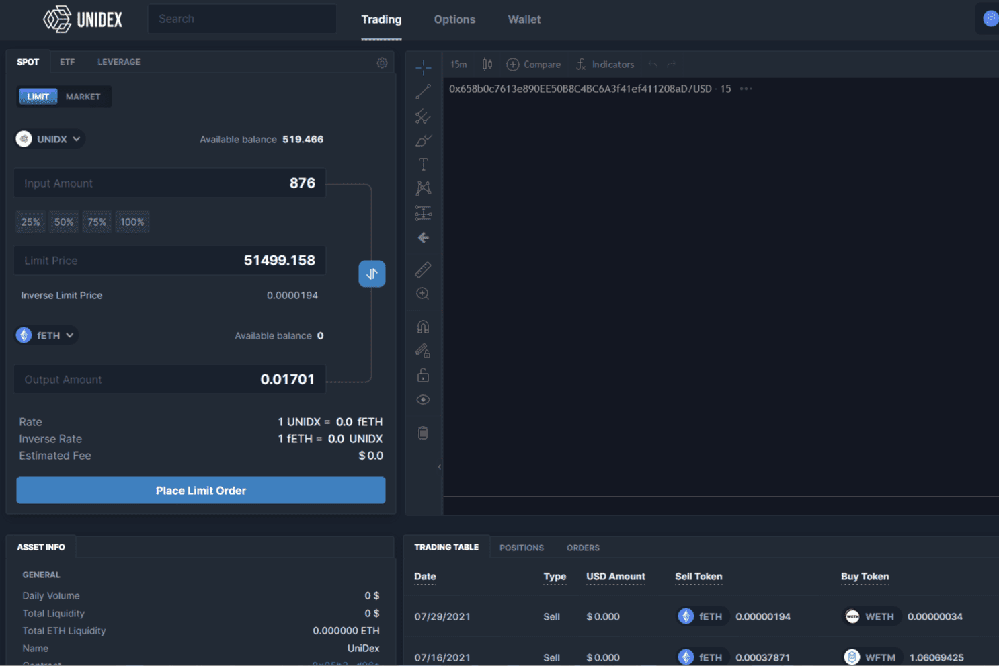

# UniDex

UniDex 提供了一个替代且信息丰富的界面，可以与您已经很受欢迎的 DeFi 项目（如 1inch、Perp.fi 和 Opyn）进行交互。 UniDex 旨在将 CeFi 交易中提供的功能连接到 DeFi 上，以帮助服务交易者并将交易者迁移到 DeFi 上。
UniDex 的支柱是发挥 DeFi 生态系统的优势。我们通过直接处理合作伙伴合同并在 10 个不同的链上工作，采用无偏见的方法来聚合交易。作为交易者，这意味着您将始终获得市场上最好的交易服务，甚至以最优惠的价格购买衍生产品。

