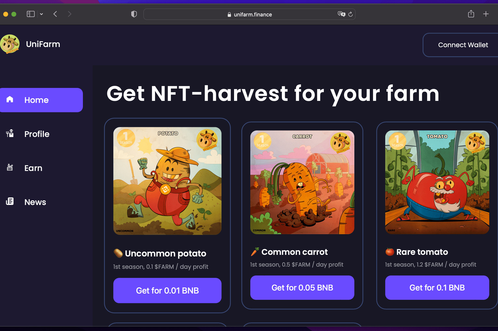

# UniFarm

新的 NFT 农业时代。购买高利润的水果和蔬菜，获得稳定的 $FARM 代币并将其兑换成 BUSD。我们的农场建立在币安智能链上。购买高利润的水果和蔬菜，获得稳定的 $FARM 代币并将其兑换成 BUSD。我们的农场建立在 Polygon 和 Binance 智能链上。您可以按照 1:1 的比例将您的 FARM 代币兑换成 BUSD。可用余额 - 0 FARM 代币。BUSD 计入期 - 几个小时。最低提款金额 - 5 FARM。每天以 FARM 代币的形式获得水果和蔬菜的奖励。

