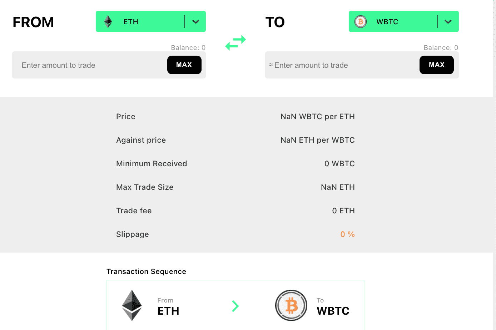

# Unifi Protocol

Unifi 协议是一组非托管、可互操作、去中心化和多链的智能合约协议，为 DeFi 开发提供构建块。 Unifi 协议由 Sesameseed 开发，考虑到更大的图景，允许在链上智能合约解决方案的去信任结构中实现可扩展性和多功能性。 Unifi 通过提供基于智能合约的构建块（通常称为数字货币乐高积木）为每个区块链增加价值，以允许开发人员和服务提供商使用 Unifi 协议来创建他们自己独特的基于 DeFi 的产品和服务。
Unifi 提供了一座桥梁，将基于以太坊的 DeFi 产品的现有经济与其他区块链上不断增长的 DeFi 市场连接起来。 Unifi 利用经过时间考验的 SEED Bridge 将任何基于以太坊或 EVM/NVM 的 DeFi 产品连接到其他区块链。
推出的第一个产品是 uTrade，这是一个具有激励流动性挖矿的交易平台。
请阅读白皮书了解更多信息，以及未来的产品和路线图。

