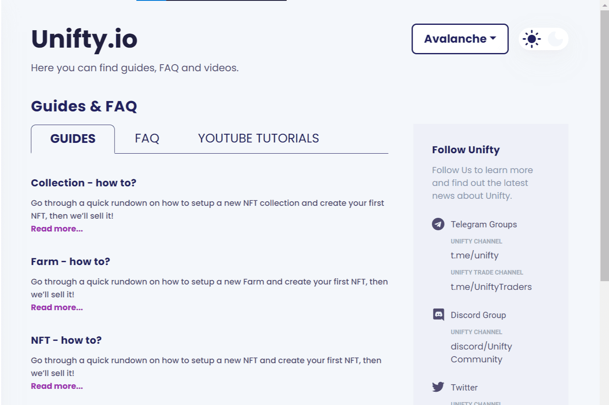

# Unifty

UNIFTY 是 NFT 项目的新中心，只需点击几下即可铸造、购买、出售、交换和创建 NFT 农场！无需编码或困难的合同交互。Unifty 是一个面向 NFT 创作者和数字创作者生态系统的多链基础设施平台。目前在以太坊、币安智能链 (BSC)、xDAI、Polygon（前 Matic）和 Celo 上运行。 Unifty 寻求为薄荷 NFT 提供可访问且负担得起的 nocode 解决方案，并启用功能。我们还在多个网络上提供市场，并提供对第一个“交互式”NFT (iNFT) 的本地支持。

