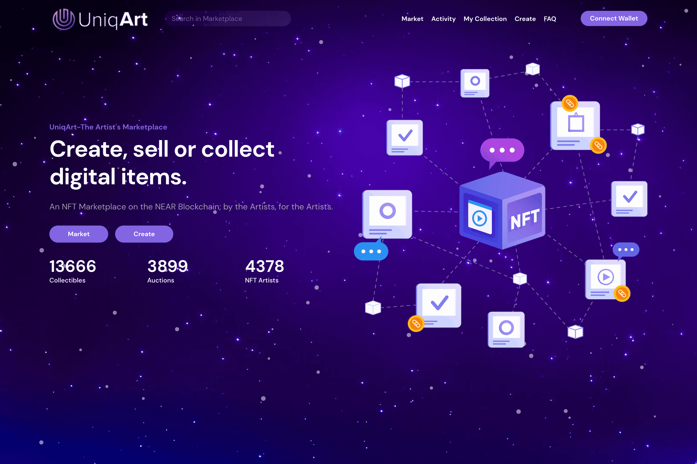

# UniqArt

UniqArt 是专为艺术家设计的 NFT 市场。
在这里，任何艺术家都可以轻松地分享他们的创作、与粉丝互动并获得相当的激励。
我们的去中心化平台让您能够与不断壮大的收藏家、买家和卖家社区建立联系，更不用说与全球各地的创作者同行了。
我们的目标
1) 传播意识：通过向创作者宣传 NFT 带来的机会
2) 支持和引导艺术家：协助创作者通过
无缝的入职体验
3) 为艺术家建立社区：鼓励独立创作者加入 Web3 革命
为什么选择优艺？
如今，许多艺人受到唱片公司、流媒体平台和发行商等“中心化”实体的恶劣对待，这仅表明事情的发展方式不会持续太久。
以音乐家为例。去年，他们每条视频流的收入不到 0.5 美分（平均约 0.003 美元）。
这些创作者如何能专注于他们的艺术并同时用这些微薄的收入养活自己？
大多数艺术家经常不得不从事兼职或全职工作以维持生计，而大流行的影响只会加剧这种情况。
我们通过让图片中最重要的实体——艺术家——真正闪耀并成为焦点，创造了 UniqArt 作为解决方案。
无论是摄影、音乐、美术、数字艺术、摄像、平面设计还是插图——如果它为世界增添了更多色彩，它应该保持在聚光灯下，创作者的努力必须受到相当的激励。

