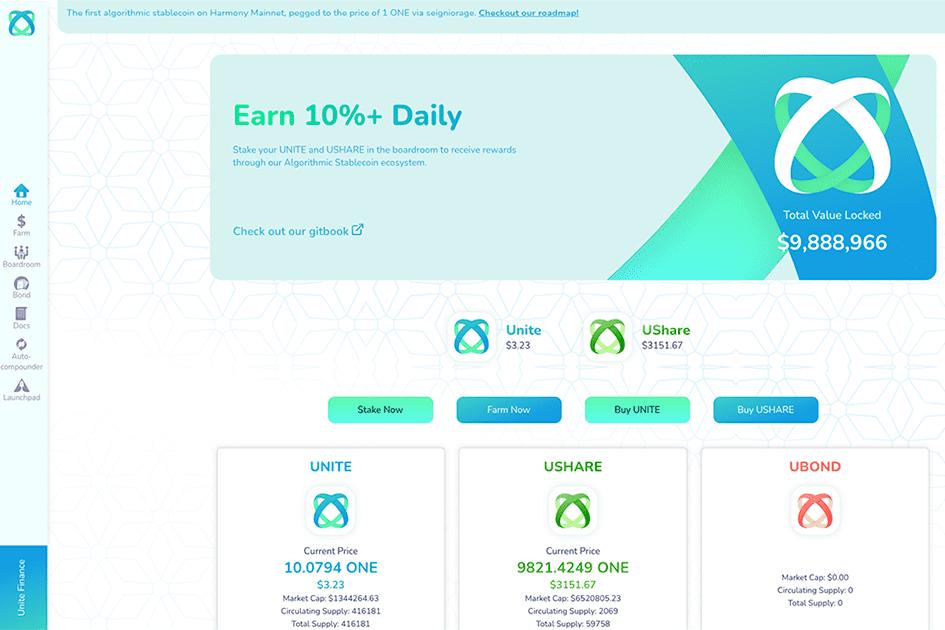

# Unite Finance

Unite Finance 的灵感来自 tomb.finance，是 Harmony 主网上的第一个算法稳定币，通过铸币税与 1 ONE 的价格挂钩。 Tomb 在 Fantom 区块链上运行，并与 FTM 的价格 1:1 挂钩。 Tomb Finance 取得了巨大的成功，我们的团队意识到需要一种与 Harmony 上的 ONE 挂钩的算法稳定币。
Unite Finance 是一个多代币协议，由以下三个代币组成：
- Unite Token ($UNITE) (交换媒介)
- Unite Shares ($USHARE)（协议价值的治理和衡量）
- Unite Bonds ($UBOND)（在收缩期间更改 Unite 供应）
Unite 算法代币是我们不断发展的生态系统的支柱，旨在为 Harmony 网络上的 ONE 持有人带来高 APR。该协议的底层机制动态调整 UNITE 的供应量，使其价格相对于 ONE 的价格上涨或下跌，以保持 UNITE 与 ONE 价格的挂钩。
Unite Shares (UShare) 是衡量 Unite 协议价值和股东对其维持 Unite 接近挂钩的能力的信任的方法之一。在 epoch 扩展期间，协议铸币 Unite 并将其按比例分配给所有在董事会中质押其代币的 UShare 持有者。
UShare 持有人对改进 Unite 生态系统和启动板内的协议和未来用例的提案拥有投票权（治理）。
Unite 有一个内置的自动组合器，可以轻松地质押和组合您的奖励。
Unite Bonds (UBOND) 的主要工作是帮助激励时期收缩期间 UNITE 供应的变化。

