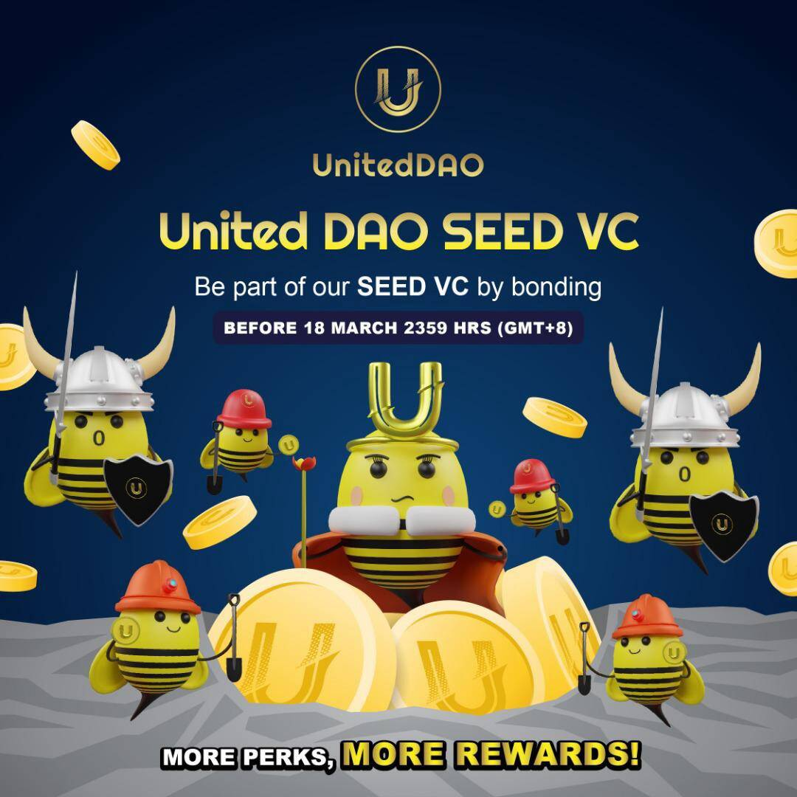

# United Dao

介绍 United DAO DEFI 的 NEXT EVOLUTION
United DAO 是基于原生代币 UTD 的下一代去中心化协议。 United DAO 旨在通过为我们的利益相关者建立真正的信誉、强大的公司治理和积极的风险管理来开创 DeFi 3.0 的新时代。
United DAO 的核心协议以三个独特的主张为基础 - United Allies Program、Rewards &amp;公用事业计划和资金管理——以及强大的推动力。有了这个，United DAO 旨在克服其前辈的缺点，并建立一个长期的、可持续的协议。
United DAO 由一支经验丰富、多才多艺的团队创立，他们拥有广泛的经验——跨越区块链、经济、金融等领域。这为协议的构建提供了坚实的基础，同时保持了拥有完全由 DAO 主导的协议的最终愿景。

