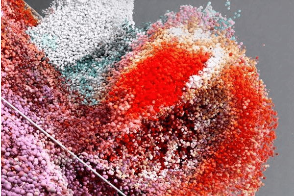

# Unseen Universe

受先进技术启发，为每个人创造更美好的未来：OMR 和 Audi 正在为 UN Refugee Aid Germany 筹集资金，其中 NFT 来自 Studio OUCHHH 的 Eylul Alici 和 Ferdi Alici 的 AI 雕塑。步的数据。

OMR 博览会上的无数真实时刻展示了实时塑造数字雕塑的各个视觉数据点。

愿景和动力以独特的 NFT 形式创造未来的艺术，为公益事业筹集资金。要获得铸造 NFT 的机会，您必须首先申请铸币列表。为此，请使用您的钱包以及您的 Twitter 和 Discord 帐户预先注册。薄荷名单上的景点于 22 年 5 月27 日在所有注册用户中**抽奖。**我们将通过电子邮件通知您是否已将其列入薄荷名单。

