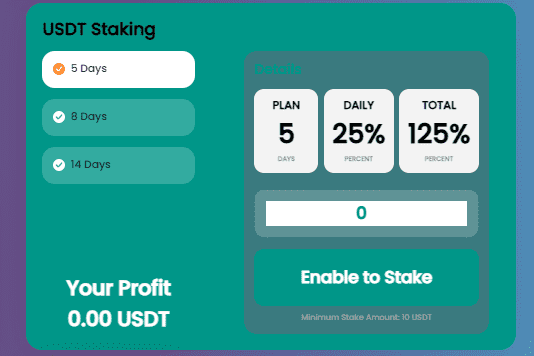

# USD STAKE

最稳定和盈利的收益。在 5 - 14 天内每天赚取 15% - 25% 的农业 DApp，即在 SHIBA、BNB、BUSD、USDT 和 CAKE 质押池的投资总回报率为 125% - 210%。 5% 的再投资红利。获得最多 3 个级别的联盟佣金：7% | 2% | 1%。最稳定和盈利的收益
币安智能链上的农业 Dapp
与 SHIBA、BNB、BUSD、USDT、CAKE、SLP、XRP && ADA 质押池。在代码中设置了 BSC 上所有收益农场中最高的 APR，智能合约的规则无法更改，没有什么可以影响收入的数量。智能合约代码已成功通过 2 家独立公司审计

