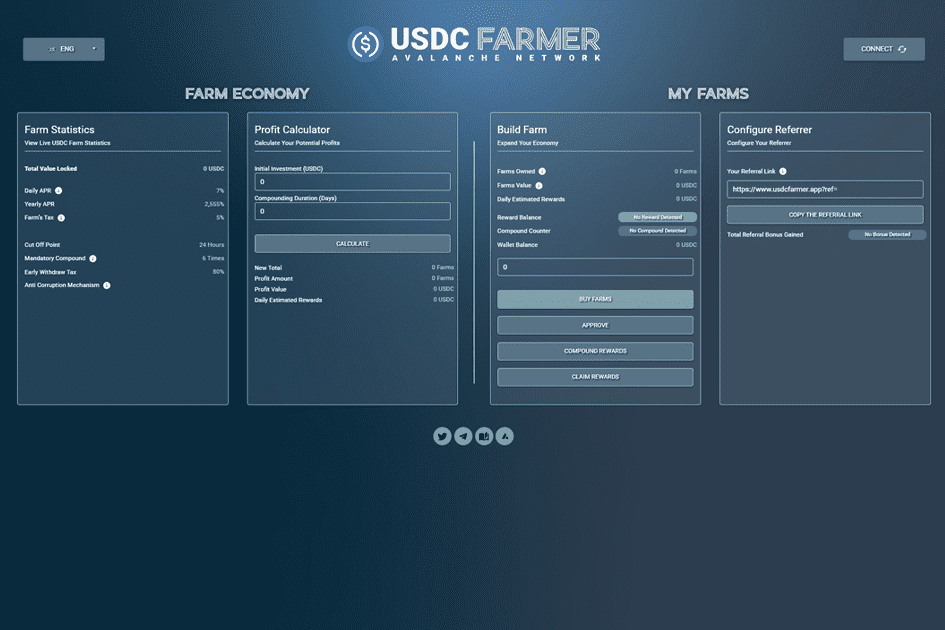

# USDC Farmer

USDC Farmer 是一个基于 Avalanche 网络的 DApp。目标是比其他投资者更快地建立您的农场。作为回报，您将获得更多的 USDC。这些农场可以让您获得农场价值 7% 的每日产量。
每日百分比回报取决于投资者在平台内采取的影响农场增长率的行动。随着用户购买农场、复合奖励并为 USDC 领取奖励，增长率会上升和下降。
USDC Farmer 正在成为 Avalanche 上最大的社区，提供尽可能高的可持续回报。你开始得越晚，你留给别人的钱就越多。
* USDC（AVAX 网络）
* 7% 每日
* 6 强制化合物
* 80% 提前取款罚款
* 复合功能每 24 小时一次
* 24 小时奖励累积截止
* 4 小时撤回冷却
* 5% 的存款和取款费用（对 Compound 不收取任何费用） * 最低存款额：10 USDC。最高：15,000 美元
* 6% 推荐

