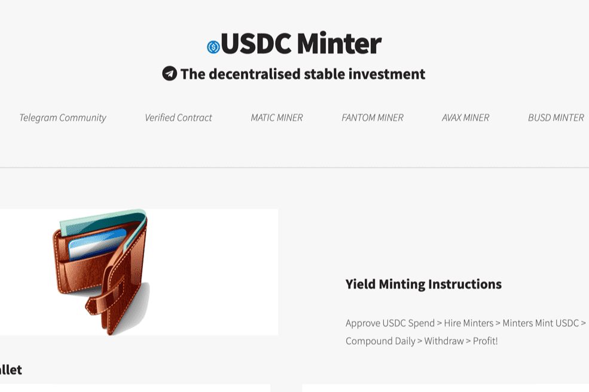

# USDC MINTER

基于流行的 BNB Miner 项目，引入 Polygon -- 稳定币变体 USDC Minter 是什么？
USDC Minter 不应与农场混淆。铸币厂不是被买来的，而是被雇佣的，因此不能被出售。一旦雇用了铸币者，他们就会无限期地为您工作，以每天 3% 的起始费率为您提供无限量的 USDC。策略是个人的，你要么严格复合又名“雇佣更多铸币者”，严格把 USDC 放在口袋里，或者你做两者的健康组合。在我们看来，最好的策略是尽可能多地进行复利，同时考虑交易气体。一旦您对每天、每周或每月的结果感到满意，就可以在您认为合适的时候尽可能多地获利，然后继续将其余部分复利。
策略和附加信息：
已验证的公共合同
USDC Minter 合约是公开的、经过验证的，可以在 PolygonScan 上找到。
USDC Minter 适用于希望获得长期利润和可持续性的用户。对于那些想要立即获利的人来说，最终会影响他人。
USDC Minters 每天支付 3% 的适度费用，让投资者高枕无忧，因为他们知道他们的投资具有无限的增长潜力和低于 3% 的最大、不可能的风险。
我们的算法允许每个参与者获得丰厚的利润，无论他们的策略如何，但它不会让任何一个参与者比其他参与者拥有不公平的优势。这真是一件美好的事情！
虽然 USDC Minter 算法确保所有参与者都获得公平份额的奖励，但它也通过其复合选项 AKA “雇用更多铸币者”来支持其最支持的参与者。

