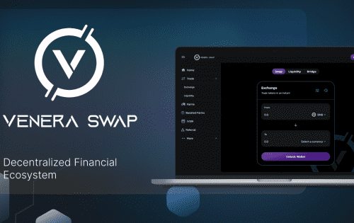

# Venera Swap

VeneraSwap 的目标是恢复用户对 BNB Smart Chain 网络和 DeFi 的信心，通过成为 BNB Smart Chain Netwtork 上第一个捕获 Curve Finance 锁定模型的 DAPP 并增加诸如 Boost 农场、非托管钱包和推荐。金星交换
使用 AMM 模型通过激励收益分享恢复用户对 BSC 网络和 DeFi 的信任。
Venera Swap 协议为用户提供交易、质押和耕作体验。还有更多。Venera Swap 服务于 2022 年推出。Venera Swap 是一项非常有前途的服务，可以激发用户的信心并帮助取得令人难以置信的成果。它使用 AMM 模型通过激励收益分享来恢复用户对 BSC 网络和 DeFi 的信心。方面将服务与其他服务分开。

Venera Swap 协议为用户提供交易、质押和农业体验。该服务的最大特点之一是提供较低的交易费用。请称其为币安智能链网络上最新的自动做市商（AMM）。很高兴见到你！

