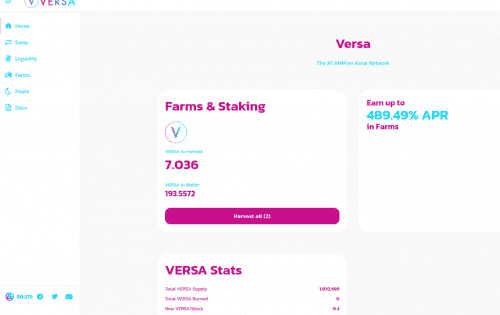

# Versa

什么是 Versa 金融？
Versa Finance 是我们计划在不久的将来发布的整个 dApp 生态系统的基础。我们的目标是构建一个面向用户体验的 dApp 工具系列，对新用户和高级用户都应该是用户友好的，我们刚刚推出了 Versa 代币、DEX 以及 Farms & Pools。欢迎来到 Versa.Finance
Versa Finance 是 Astar Network 上面向用户体验的 dApp 系列。我们的目标是让每个人都可以使用加密货币，包括新用户和专家。

敏捷
我们发布的第一个产品是 Astar Network 的自动做市商 (AMM) 去中心化交易所 (DEX)。它在 2022 年 4 月 2 日与 Twitter 公告一起秘密发射。\

