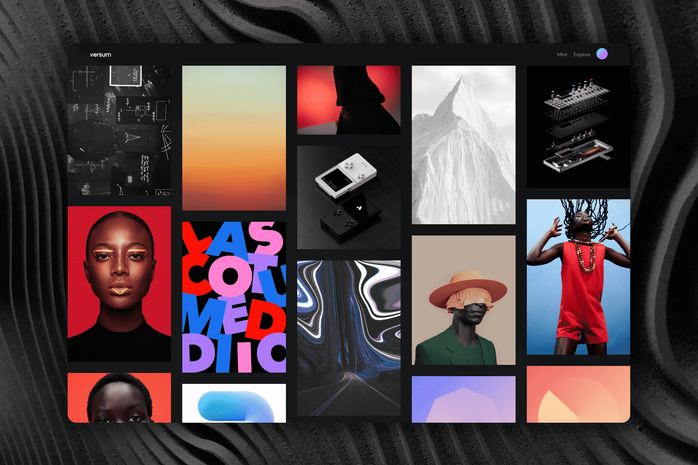

# Versum

Versum 是由来自世界各地的 Hic Et Nunc 校友团队对艺术和创作者的坚定承诺而构建的，它是下一代 NFT 平台和元界，在智能合约级别提供独特的功能，可防止复制、机器人和收藏家和创作者的其他类型的问题。
Versums NFT 代币“物品”具有链上和链下的附加功能，例如在铸币和输液上生成的分散媒体表示的多个质量级别，以使代币能够用于分散的 p2p-PvP/PvE 机制，仅举几例。
Versum 原生代币“Materia”根据 Versum 和其他辅助 Tezos NFT 生态系统以及社交媒体渠道（Discord、Twitter、Reddit）内的历史和当前交易活动持续向用户发行。
Metaversum 是即将到来的元节，它引入了几个独特的功能，专注于 DAO 对行星和地块的所有权。最初专注于艺术和活动空间，它将在某些领域通过完全分散的点对点 PvE 和 PvP 机制进行扩展，为包裹持有者创造收入流。

