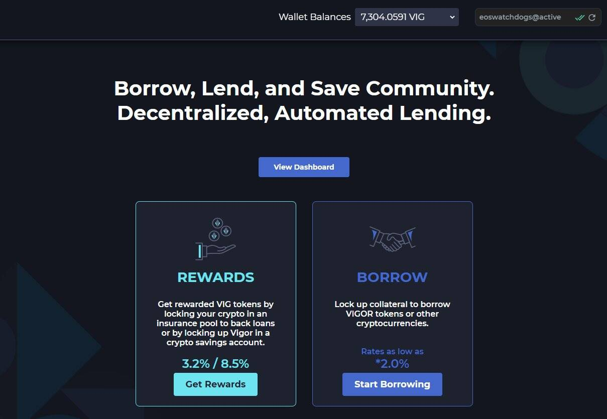

# VIGOR

VIGOR 协议是一个借、借、存社区。 . VIGOR 协议的核心主题是加密支持的代币从根本上关注跳至零的价格风险和波动风险。 Vigor 协议能够分离和转移这些风险。 VIGOR 是在我们平台上创建的低波动性支付代币（“现金”工具）；它是跟踪美元的 EOS 区块链上的加密货币支持的代币。在更广泛的背景下，Vigor 协议是一个去中心化的自主智能合约主经纪商，它使用户能够： A. 用一篮子加密代币抵押品借用 VIGOR。 B. 借用 VIGOR 代币抵押品的 EOS 原生代币。 C. 将代币借给借贷池并获得 VIG 代币奖励。 D. 将 VIGOR 代币锁定在储蓄账户中以获得 VIG 代币奖励。 VIG 是实用代币，用于平台费用和奖励。用户在使用 Vigor 协议时建立声誉评分，为他们提供平台折扣。我们的技术白皮书：https://vigor.ai/vigor.pdf

