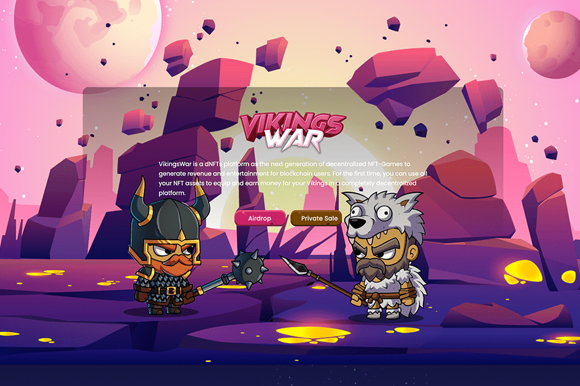

# Vikings War

VikingsWar 是一个 dNFT 平台，作为下一代去中心化 NFT 游戏，为区块链用户创造收入和娱乐。第一次，您可以使用您所有的 NFT 资产在一个完全去中心化的平台上为您的维京人装备和赚钱。
VikingsWar 中有 2 种代币。实用代币和 NFT 代币。您可以使用实用代币购买 Viking 或设备或分享项目治理和平台收入。 NFT 代币是基于 ERC-721 标准的代币，通过拥有该代币，您是游戏中具有独特个性的维京人的拥有者。您可以在市场上玩、投注、复制 Vikings 或买卖。

