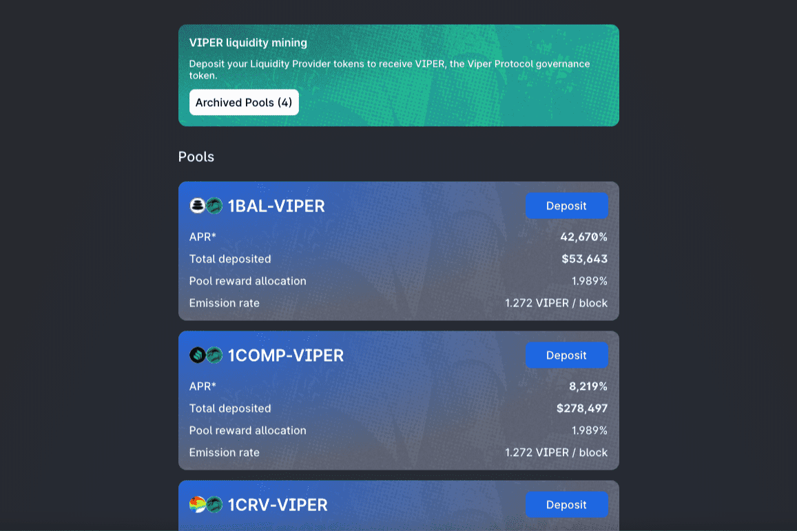

# ViperSwap

ViperSwap 是一个自动化做市商 (AMM)、去中心化交易所 (DEX) 和允许用户交换代币、提供流动性和赚取交易费用的 DeFi 协议。 ViperSwap 是 VenomDAO 的一部分，它将在 Harmony 上发布多个 DeFi 产品。	Harmony 的桥接 API  似乎存在问题，它会以某种方式将锁定的 WAGMI / WAGMIGAMES 令牌与我们的令牌混淆，并采用桥接的数量为 14,784,552.47 WAGMIGAMES 代币并将其乘以 Euphoria 的价格 /TLDR；在 Avalanche 上将整个国库兑换为原生 USDC 的提案。投票将于今天 8 月 18 日下午 6 点/世界标准时间 18:00 开始，并将于 8 月 21 日星期日中午 12 点/世界标准时间 12:00 结束。

​	
​				
​				
​						
​				

