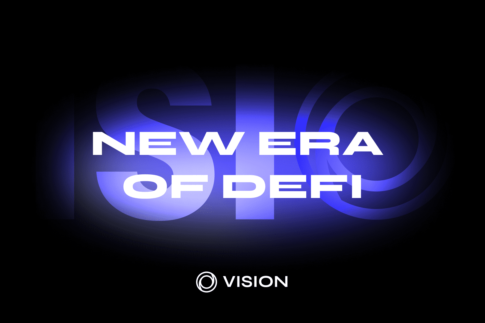

# Vision Fi

Vision 是一个在 OASIS 上结合 DEFI 和 NFT 的平台。
从 IDO 和 Mint（债券销售）筹集的 VISION 基金将使持续和可持续的回购成为可能。 $VSN 的耕作期有限，这也将确保 $VSN 的底价上涨。
有限数量的 NFT 将空投给质押 $VSN 的人。 NFT 持有者将能够在专属的农场池中进行农场。
Stableswap 即将上线，支持各网桥之间安全、完整的 1:1 链上转换。我们就快到了！
您不仅可以零滑点兑换稳定代币，还可以通过质押您的马厩获得USDT/USDC的高收益！
不要错过发布公告，因为质押的名额有限，以确保高收益。

