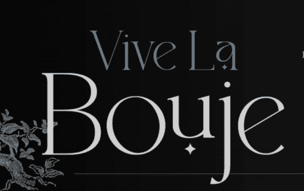

# Vive La Bouje

在 Bouje Finance 的成功基础上，Vive La Bouje 是基于 Fantom 区块链的第二代单产农业平台，旨在实现积极稳定的价格走势。利用称为 APR 重置的新时代系统（受 Swift Finance 启发）。对于 APR 重置，其概念是每周停用非本地池，并用社区有权决定的新池替换它们。这将有助于重置 APR 并将其提高到吸引新人存款的水平。此外，这将有助于农场获得新一轮的存款费用以继续运作。最新一轮的存款费用将重新投资于原生代币 Vive，从而推动对代币价格的支持。 Bouje 团队致力于为目前加入 Paladin Security 的投资者建立一个安全和支持性的生态系统，以对其智能合约进行审计。使该项目更加独特的是上面提到的 APR 重置，这将有助于延长农场的耕作寿命。由于没有足够的资金来继续支持当地人，许多收益农场随着时间的推移而失败。然而，我们的概念通过允许新资金有理由不断流入来直接解决这个问题。

