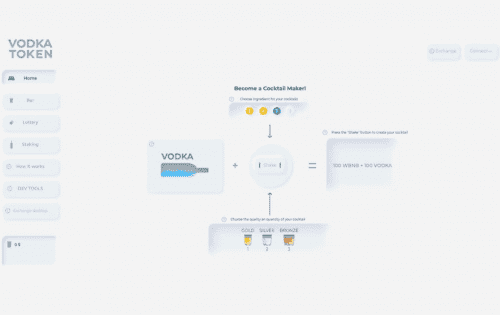

# Vodka Token

VODKA 代币 – 基于 DeFi 的可收藏的赚取 NFT 游戏。
🍹在游戏中，参与者使用各种机制获得游戏内货币（“VODKA”或伏特加代币），他们“摇”（花费）在 NFT 鸡尾酒上——游戏的主角。鸡尾酒的外观、成本和稀有程度各不相同。
💰游戏的参与者可以在各种市场上出售 NFT 鸡尾酒，使用高达 144% PA 的质押，或者在公平的彩票中碰碰运气并赢取高达 300% 的奖金。
游戏特色：
• 一个项目中最流行的趋势：
去中心化金融 (DeFi)、DeFi 游戏、不可替代代币 (NFT)、质押、多链。
• 无需注册。仅元掩码
•  简单的。透明的。通过智能合约
• 基于项目的数学计算和机制的 Staking 具有吸引力的百分比

