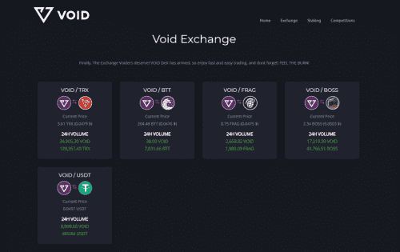

# VoidDefi

Void Defi 是一个去中心化的交易所，旨在利用通货紧缩的代币。我们通过选择成为流动性提供者和成为 Dex 所有者的选项彻底改变了 uni-swap 交易所，从交易所费用中收取您的股息份额。它是人民拥有的Dex！与传统的单交换式交换类似，Void Defi Dex 遵循一些常见的单交换原则。然而，与大多数典型的 uni-swap 相比，Void Dex 有一些独特的差异。

这篇文章将涵盖 Void Defi Dex 的所有基础知识。如果您仍有任何疑问，请随时加入我们的电报，并问我们任何您喜欢的问题。 

