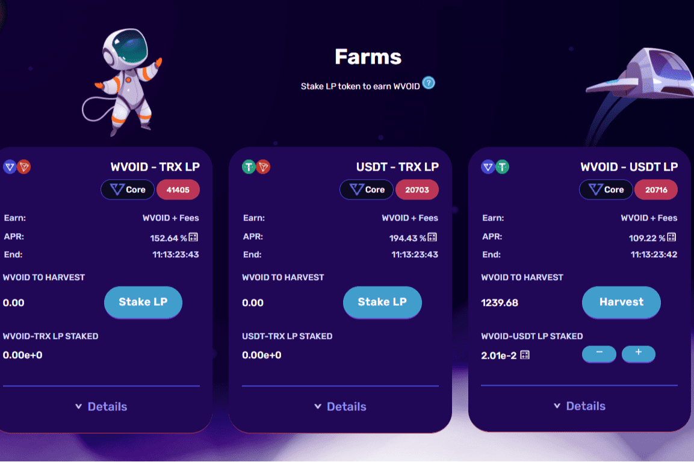

# VoidSwap

voidswap可以通过3种不同的方式帮助您充分利用加密货币：
void是一个已经开发了多个DAPP的项目，例如VoidBank/Voidglass，其持有超过1M TRX。 Voidswap是最新的项目，肯定会吸引许多新的投资者。 Voidswap是类似于Uniswap的分散交易所，但在TRON链上，旨在提供安全，有趣和有意义的交易经验。
PS：已经退休了几个DAPP，因此在使用任何现有的DAPP之前就更好地问。
贸易，赚钱和获胜。VoidSwap 是建立在 Tron 链上的去中心化交易所，旨在提供安全、有趣和有益的交易体验。

