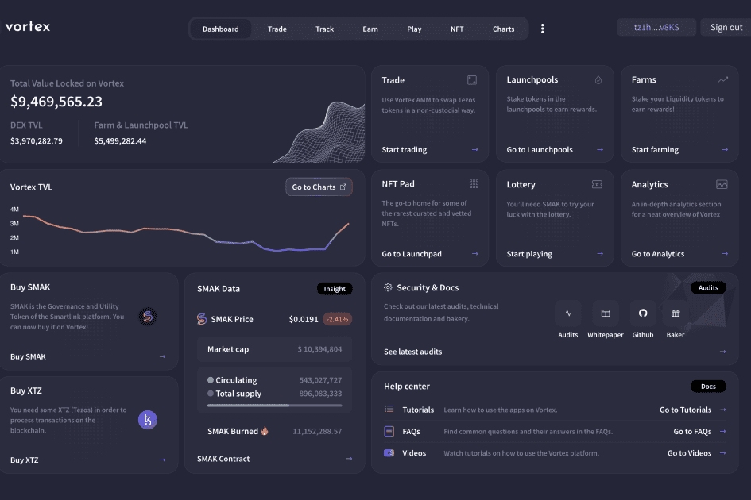

# Vortex

xxxxxxxxxx Tezos 区块链上领先的一体化去中心化金融协议。使用下一代 DeFi 功能进行交易、赚取和玩游戏，以最大限度地提高收入，同时降低 Vortex AMM 的风险和汽油费。优化的 DeFi 生态系统Vortex 为 Tezos 区块链上的交易者、流动性提供者和开发人员提供了一些最复杂的 DeFi 工具。 Vortex 生态系统是一套不断增长的可扩展 Dapp，旨在通过有吸引力的 APY 推动流动性。NFT 启动板获取由 Vortex 社区审查的互联网上一些最稀有的精选 NFT。功能包括盲铸、拍卖和盲拍卖。绿色清洁Vortex 签署了加密气候协议，因为它建立在 Tezos 之上，Tezos 是一种可自我升级且节能的股权证明区块链，具有低碳足迹。

