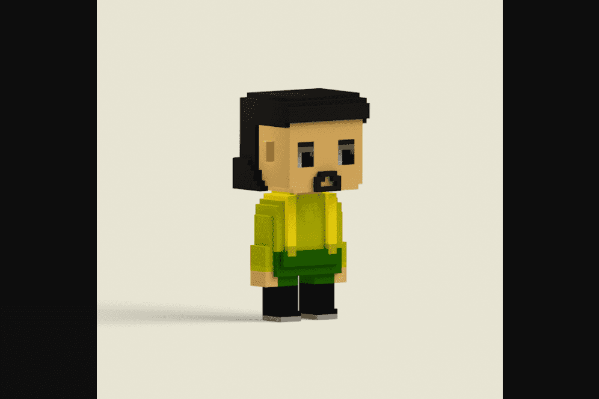

# Vox Collectibles

拥有、交易、玩耍和赚取您独特的 NFT 角色——每个角色都有自己的外表、工作和个性
每个 VOX 都是一个独特的 ERC721，具有可证明的随机特征，符合他们的性格。首个系列将永远只有 8,888 个字符
每个人都可以用 0.0888ETH 购买一个 VOX。当 VOX 售出 50% 时，稀有物品将开始显现
当您拥有 VOX 时，您将获得 FBX 文件，这样您就可以在 Metaverse 中制作动画并与它们一起玩。Gala 正在创造一种您将真正享受的元宇宙体验，通过与数字宇宙的伟大创新者 Sims 创作者 Will Wright 合作，以全新和独特的方式将 VOX 带入生活。

VOXverse 不仅仅是收集和制作的无尽苦差事，它是一个尖端 Web3 技术的数字世界，让收藏家可以探索、玩耍和赚钱。

建立记忆，驾驭恐惧，磨练你的技能。开发您的数字身份并尽情享受。

