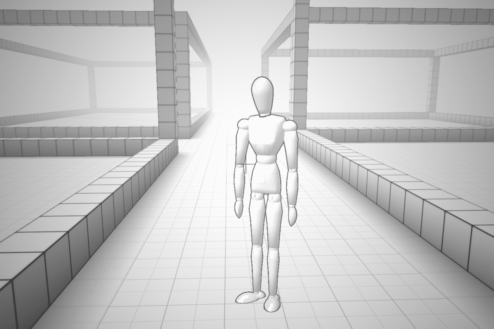

# Voxels

以太坊区块链上的虚拟世界。在 Cryptovoxels 的街区和街道上建造、开发和销售财产。您拥有自己的土地，您的所有权永久记录在区块链上。我计划“修复”包裹市场。

1.烧掉我们拥有的巨型包裹
2. 将不需要的包裹烧毁或转换为公地
3.增加音量
4.尽量不破坏地板
5. 创造空间建设者的需求
6.增加包裹效用

为复兴而毁灭

美国东部时间：8 月 24 日，晚上 10 点至凌晨 12 点
UTC：8 月 25 日凌晨 2 点至凌晨 4 点
新西兰时间：8 月 25 日，下午 2 点至下午 4 点

（美国东部时间：星期三
UTC，新西兰时间：周四）

