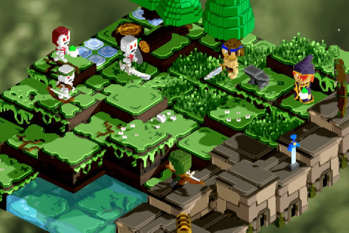

# Voxies

Voxies 是可爱、可爱和可收藏的 3d 体素伙伴，它们在以太坊区块链上生活和玩耍。现存的只有 10,000 个 Voxies，没有两个 Voxies 是相同的。许多随机属性和有趣的特征使每个 Voxie 变得可爱、独特，有时甚至是罕见的！
Voxies 不仅是一个收藏品，而且是第一个也是唯一一个与可玩 RPG 回合制战术游戏完全集成的 NFT。当您在 Voxiverse 中收集、战斗并获得奖励时，在 Voxie Tactics 中让您拥有的 Voxies 栩栩如生。 VOXEL 代币授予 Voxies 的所有权，并在 Voxie Tactics 和二级 Voxie 市场中用作货币。

