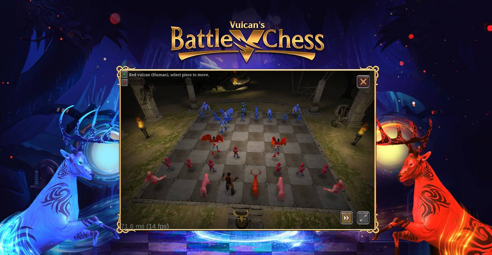

# Vulcan's Battle Chess

Vulcan's Battle chess 是一款使用 VulcanVerse 中的 Vulcanites 的在线多人国际象棋游戏。玩速度国际象棋以获得参加当日 $LAVA 奖池的资格。管理 PYR、LAVA、MATIC 和 ETH 等多种加密货币。
查看和跟踪您的活动、成就、排名、XP 和收入。
管理、查看、升级、投注、播种或喂养您的 NFT 游戏资产
,例如
Vulcanites、土地、物品等。
在 Vulcan Forged NFT 市场上购买、出售和交易,并直接在钱包中
购买 PYRX, USNÉ VulcanVerse, BlockBabies, Berserk,
Coddle Pets 等的独家数字资产。用于创建、销售和收集NFT的数字艺术平台。

