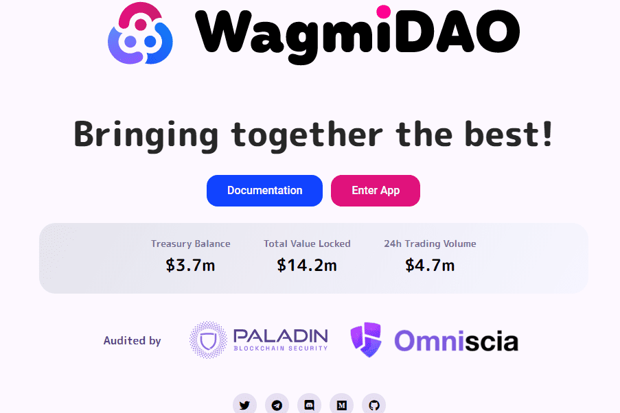

# WagmiDAO

WagmiDAO 是第一个多链储备支持的去中心化交易所（RDEX）。它专注于不断增长自己的国库和原生代币的价值。
WagmiDAO 的整个理念受到了一些最著名的现代 DeFi 协议的启发——Olympus DAO、Frax 和 AMM DEX 模型。
WagmiDAO 将已经建立的流动性挖矿与债券相结合，并在其上构建了一个 AMM DEX，部分抵押的稳定币 $FAM 作为财政部通过外部协议赚取收益的基石，从而通过外部实现提高了 $GMI 代币的底价收入。
WagmiDAO 将首先在 Harmony 网络上推出，更多的链正在开发中。
它完全致力于公平启动，这意味着没有任何种子轮、私人资金或任何风险投资
激励用户为流动性池提供资金并在 WagmiDAO 上购买债券，以获得原生代币 - $GMI。
WagmiDAO 能够支持 $GMI 代币的底价。 WagmiDAO 财政部积累的所有价值都集中在提高 $GMI 代币的底价，从而增加整个生态系统的价值。

