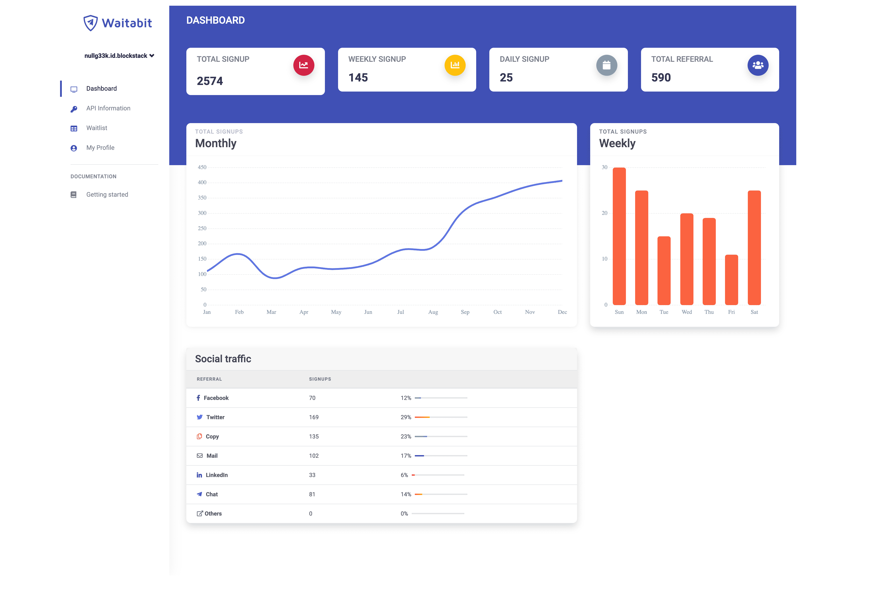

# Waitabit

Waitabit 是第一个基于堆栈连接和 gaia 存储的去中心化系统。它可以帮助初创公司启动他们的早期测试程序，并帮助安全地收集/存储用户信息。
Waitabit 让您能够使用简单的 API 在一处创建候补名单和推荐计划。
Waitabit 提供了很多功能，这里有几个值得一提的：

- 简单直观的 API

- 具有分析功能的干净且富有洞察力的仪表板

- 通过 csv 和 API 导出

- 快速入门的免费无代码模板

- 开发人员友好的沙箱 API

- 更多关于社交分享的分析

- 内置排名和游戏化

- 和更多！

  
