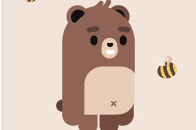

# Walken

Walken 平台体现了将数千名新用户加入 DeFi 的机会。
Walken 是一个游戏和练习，由一个拥有超过 5000 万应用商店下载量和 1000 万美元年收入的团队构建的移动应用程序。
用户通过锻炼和应用内游戏获得 WLKN 代币奖励，他们在游戏中的角色是 NFT，这意味着用户不仅可以获得代币，而且还可以创建可以在 NFT 市场买卖的 NFT。在 Walken® 平台内多走几步，与您的 CATthletes 一起参加各种对战游戏。该平台的设计方式允许玩家通过使用所有游戏内机制来获得经济利益。

