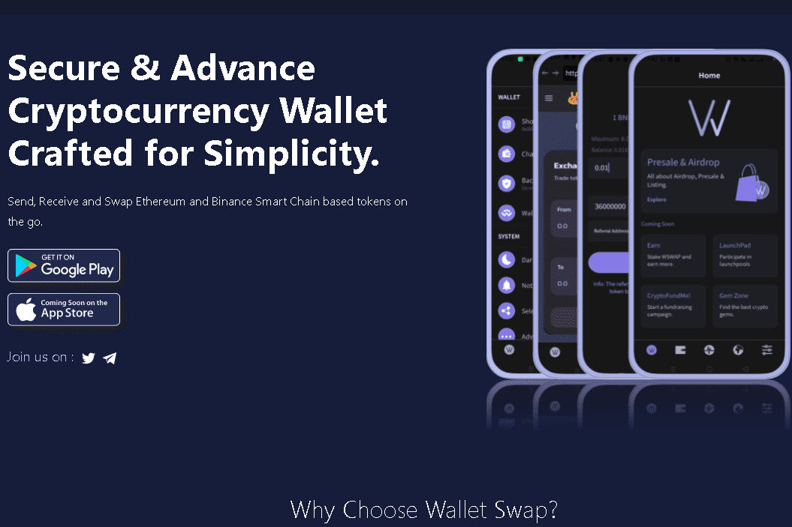

# Wallet Swap

WalletSwap 是基于去中心化币安智能链和以太坊的 Web3 移动钱包。该应用程序适用于多个加密代币和区块链钱包。它使用户能够在旅途中存储、发送和接收基于智能链和以太坊的代币。这些功能的设计重点是用户体验，为幼稚和经验丰富的爱好者提供了全套功能。 WalletSwap 提供无缝的用户体验。我们相信易用性对于采用加密货币至关重要，这是一种用于访问区块链的高度直观和用户友好的移动应用程序。
Playstore 链接：https://play.google.com/store/apps/details?id=com.wswap.wallet
WSWAP 代币和用例 WSWAP 将成为我们生态系统中的首选代币。作为首选代币，我们计划使用 WSWAP 代币进行质押、治理、支付交易费用并获得 WalletSwap 启动池的资格。让我们详细了解它们。
质押用户将能够直接从您的 WalletSwap 应用程序质押 WSWAP，并且奖励将在收获时添加回他们的钱包。
治理 WSWAP 代币持有者将影响有关项目的决策，例如提出或决定新功能、提案甚至改变治理系统本身
迷你 NFT 钱包交换提供了一种简单的方法来存储和访问您所有的加密收藏品，让您安心和安全。 WalletSwap 将允许 WSWAP 持有者在 WalletSwap NFT 市场上传和列出数字艺术品。
LaunchPool 资格 WalletSwap Launchpad 将为希望从智能合约提供的安全性和去信任性中受益的新区块链项目提供全方位服务的启动板。 WSWAP 代币持有者将有资格参与 WalletSwap 启动池。

