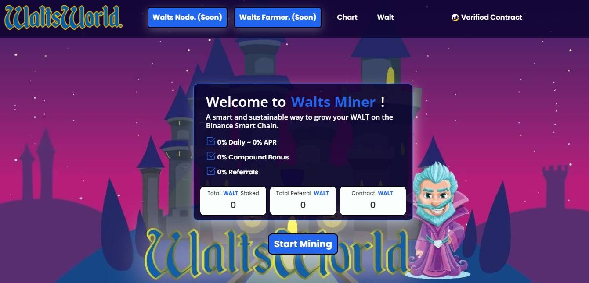

# Walts Miner

Walt Miner 是一款基于币安智能链的去中心化游戏。游戏的目标是比其他玩家更快、更频繁地雇佣更多的矿工。这反过来又可以让您更快地获得更多的 WALT。这些矿工不知疲倦地为你工作，平均每天支付你矿工价值的 6%。每日百分比回报取决于用户在平台内采取的影响矿工效率的行动。随着用户雇佣矿工、复合收益和口袋 WALT 奖励，挖矿效率会上升和下降。一旦矿工被雇佣，他们就不能被出售，购买他们的投资（通过存款或复利）也不能收回。但是，一旦购买，矿工将不会停止生产收益。

