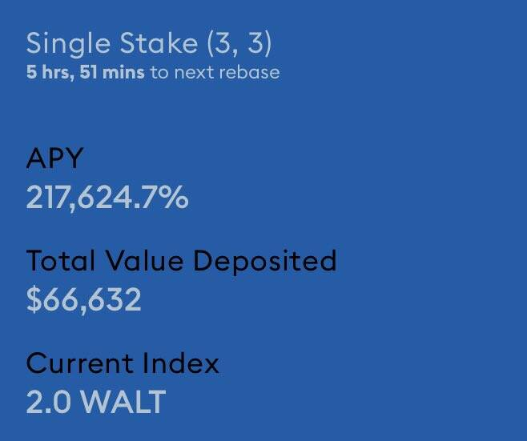

# WaltsWorld

xxxxxxxxxx WaltsWorld 是一个旨在成为 DEFI 万物中心的生态系统。我们使用 DEFI 3.0 并投资我们的资金来赚取收益和利润，这些收益和利润用于回购、营销和开发。我们与其他平台的不同之处在于，我们不断地为 $Walt 和平台构建和添加新的用例，我们正在推出一个 DAO 和矿工 post IDO。接下来是农场、DEX、NFT 等。WaltsWorld 是基于 WALT 代币的去中心化储备货币协议，旨在构建社区拥有的去中心化金融基础设施。

