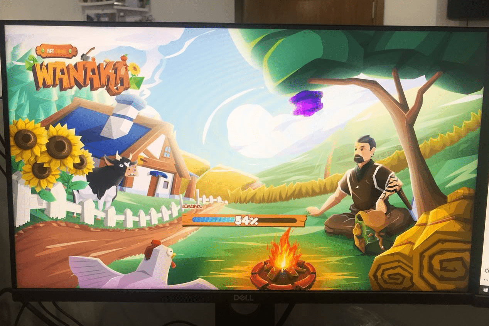

# Wanaka Farm

瓦纳卡农场是一款多人游戏瓦纳卡是经典游戏和区块链游戏的完美结合，其中一个快乐的农业世界是由新西兰南部一个名为瓦纳卡的梦幻般的美丽岛屿创造和启发的。玩家将体验冒险的任务和选择来设计自己独特的土地。
瓦纳卡的口号是“放松和赚钱”。与其他一些玩家必须与他人竞争的游戏不同，Wanaka Farm 的核心价值是基于用户之间的协作。该游戏具有广泛的吸引力，针对来自世界各地不同年龄段和社会阶层的不同玩家：企业家、高管、经济学家、视频游戏玩家、加密货币爱好者等......

