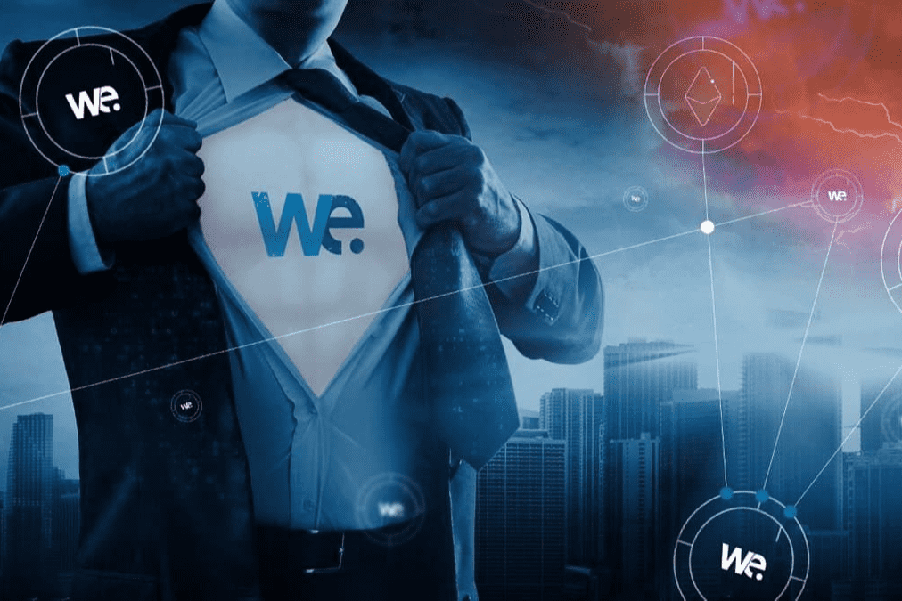

# WandaExchange

WE 代币是万达交易所的原生代币，可用于全球每个参与的 POS 合作伙伴或万达现金交易所的折扣和快速支付。我们开始使用币安智能链——但在 60 个月内（代币锁定），我们将发布他们自己的 AI-Blockchain 解决方案。该解决方案是为即时支付而开发的，为买家和卖家保证最优惠的价格。我们的智能 AI 解决方案将检测最佳时机并交换以在所有市场（DEX 和 CEX）上以最高价格出售代币。
我们独特的专利 POS 系统以非常流畅的方式为买家和卖家工作。虽然买方可以轻松地以加密货币付款 - 卖方将在几秒钟内收到确认，并在 20 分钟内收到法币资金到他的公司银行账户。
在获得 SEC 批准后，万达 ATM 产品线将在 2022 年第二季度左右发布。万达 ATM 将作为传统 ATM 用于加密货币。由于万达的道德政策，将只提供提款。

