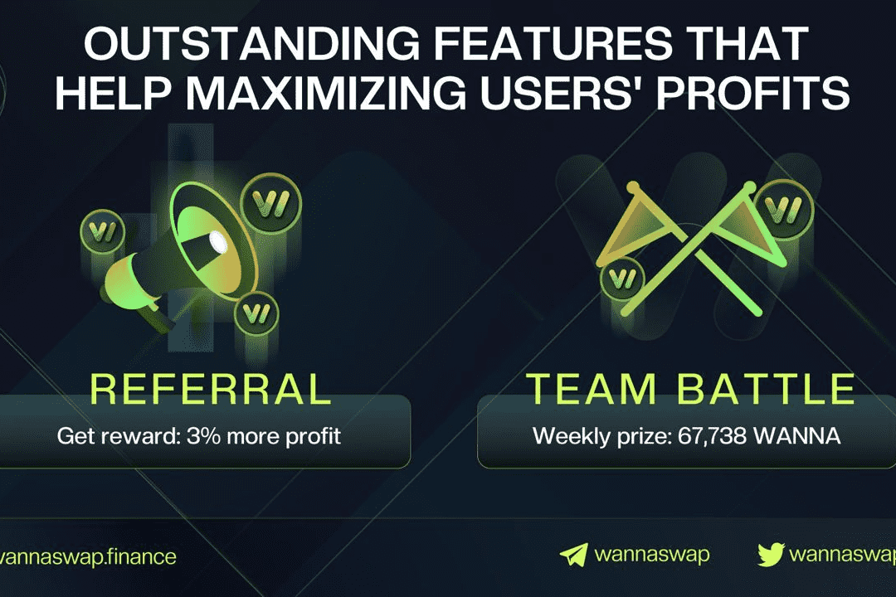

# WannaSwap

出于对 Near Protocol 增长潜力的信念以及有关“桥”Aurora（以太坊虚拟机）开发的信息，我们正在构建一个交钥匙解决方案，以便开发人员在与以太坊兼容的平台上运行他们的应用程序，高吞吐量、可扩展且面向未来的平台，其用户交易成本低。 WannaSwap 团队已经成立，并计划建立一个 DEX，目标是成为 Near 的 Aurora EVM 的流动性中心。

WannaSwap 是一个建立在 Aurora EVM 和 NEAR 区块链上的去中心化交易所 (DEX)。在 WannaSwap 上，代币可以被交换、质押、耕种、放置在流动性池中，并通过治理功能进行投票。WannaSwap LaunchPad 是一个新的 IDO 平台，用于在 NEAR 生态系统上启动新的区块链项目。

