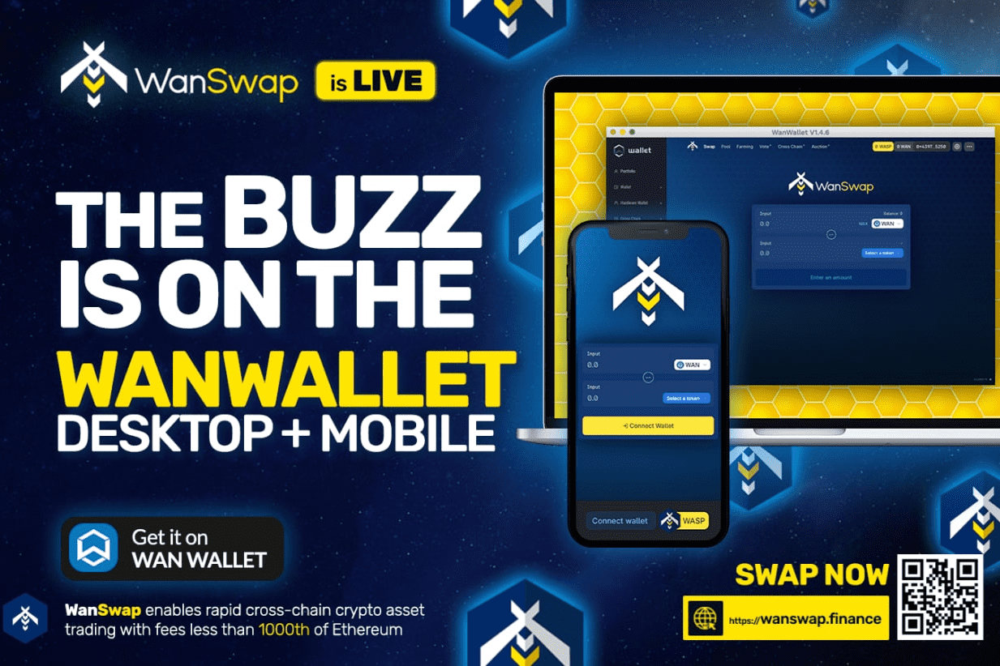

# WanSwap

Wanswap 是一个基于 Wanchain 区块链的去中心化跨链 AMM DEX。除了交换代币和提供流动性外，WanSwap 还具有农业和 Staking 功能。它充分利用了 Wanchain 的跨链特性，以便使用 Wanchain 的跨链 wanToken 实现多个区块链资产之间的顺畅、廉价（tx 0.0001 美元）和快速的交易，包括：WRC20、wanEOS、wanBTC、wanETH，一个不断增长的wanERC20 代币列表，以及更多链和资产即将添加。这是一个社区项目，使用治理代币，分发给流动性提供者（WASP）。现在在 DeBridges 上！WanBridge 是 Wanchain、Ethereum、Polygon 等之间的 Wanchain 跨链交易的基于浏览器的界面。

